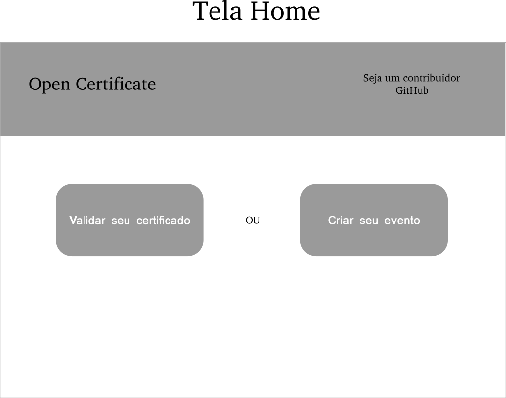
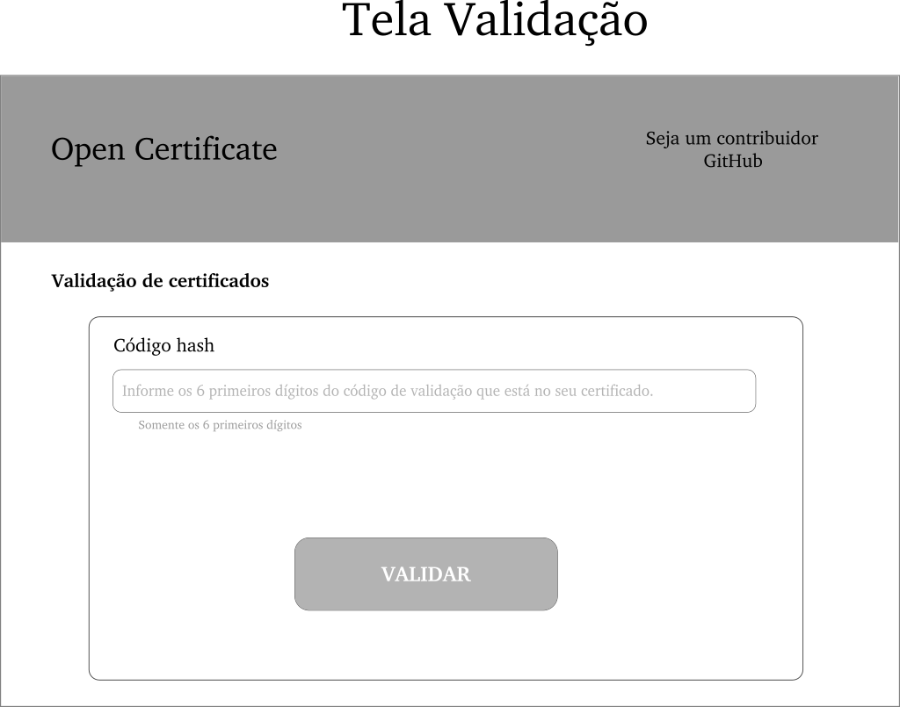
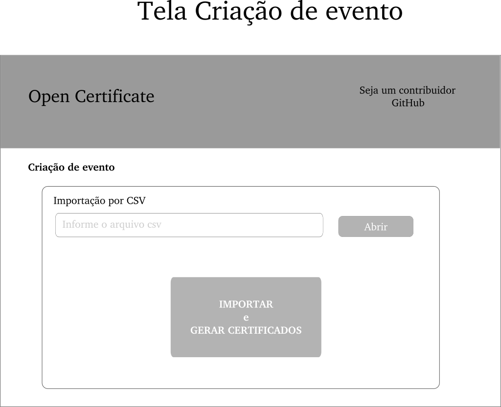

# OpenCertificate
Projeto para criar plataforma para gerar certificados online para comunidades.

## Frontend
O projeto tem um frontend feito em React e hospedado com carinho no Heroku.

Páginas do frontend: 

Mais detalhes para contribuição acesse [Readme.md Frontend](./frontend/README.md)

## Backend
O projeto tem um backend feito em Quarkus e um banco de dados Postgresql hospedado com carinho no Heroku.

Mais detalhes para contribuição acesse [Readme.md Backend](./backend/README.md)

## Seja um contribuidor
Entre em contato pelo email opencertificate@gmail.com e solicite como ser um contribuidor, estamos anciosos para te conhecer e obter suas contribuições.